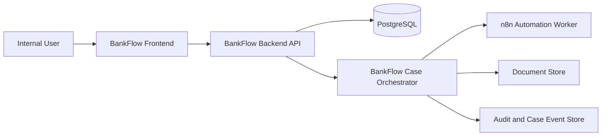

# BankFlow Technical Design Document

## 1. Document Purpose

This document defines the technical design for BankFlow, the banking case orchestration platform to be derived from the HRFlow repository.

This document is the low-level design companion to `BANKFLOW_PRD.md`.

It focuses on:

- target architecture
- system boundaries
- data model
- execution model
- node library design
- backend and frontend modules
- API design
- security model
- deployment model
- implementation sequencing

## 2. Design Principles

BankFlow should be designed around the following principles:

1. BankFlow owns case state.
2. Human tasks are first-class runtime concepts.
3. Auditability is built into the primary data model, not added as an afterthought.
4. The visual builder remains the authoring source of truth for case flow definitions.
5. n8n is used where it is strongest, namely automation and integration steps, not as the sole owner of banking case lifecycle state.
6. The MVP architecture should remain simple enough to implement quickly, but not so simplified that it undermines the banking case orchestration model.

## 3. Target Architecture

## 3.1 High-Level Architecture

### 3.2 Architecture Shift From HRFlow

Current HRFlow model:

- HRFlow compiles a workflow into n8n.
- n8n executes the workflow.
- HRFlow reconstructs execution visibility afterward.

Target BankFlow model:

- BankFlow stores case flow definitions.
- BankFlow creates and owns case instances.
- BankFlow evaluates graph progression.
- BankFlow creates human tasks, approvals, assignments, and SLA events.
- BankFlow calls n8n only for automation nodes.
- BankFlow stores all case state, task state, and business events directly.

This is the most important technical design decision in the project.

## 4. Proposed Technology Stack

### 4.1 Core Stack

- Frontend: React + TypeScript + Vite
- Backend: Express + TypeScript
- Database: PostgreSQL
- ORM: Prisma
- Automation worker: n8n
- Deployment: Docker Compose

### 4.2 Optional Or Deferred Technologies

- generalized document extraction service only if a use case demands it
- scheduler/queue service only if SLA/timer needs exceed simple backend scheduling for MVP

## 5. System Boundaries

### 5.1 BankFlow Responsibilities

BankFlow is responsible for:

- user authentication and authorization
- flow definition management
- node and edge configuration persistence
- case creation
- case status tracking
- task creation and completion
- assignment and queue ownership
- approval lifecycle
- escalation lifecycle
- case document association
- case timeline and audit trace
- supervisor oversight dashboards

### 5.2 n8n Responsibilities

n8n should be responsible for:

- executing system automation nodes
- integration calls
- notifications
- enrichment or transformation steps

n8n should not be the source of truth for:

- case status
- task ownership
- approval outcomes
- escalation state
- case closure state

## 6. Domain Model

This section proposes the domain model BankFlow needs for MVP.

## 6.1 Core Entities

### 6.1.1 Users And Roles

Keep the existing user and role foundation, but extend it with teams/queues.

Proposed entities:

- `users`
- `roles`
- `teams`
- `team_memberships`

Possible roles for MVP:

- Admin
- Designer
- Operator
- Supervisor
- Approver
- Auditor

### 6.1.2 Case Flow Definition Entities

Proposed entities:

- `case_flows`
- `case_flow_nodes`
- `case_flow_edges`
- optional `case_flow_versions`

Suggested fields for `case_flows`:

- `id`
- `name`
- `description`
- `case_type`
- `status` such as `draft`, `published`, `archived`
- `owner_user_id`
- `active_version`
- timestamps

### 6.1.3 Case Runtime Entities

Proposed entities:

- `cases`
- `case_tasks`
- `case_events`
- `case_approvals`
- `case_escalations`
- `case_documents`

Suggested fields for `cases`:

- `id`
- `case_flow_id`
- `case_reference`
- `case_type`
- `status`
- `priority`
- `current_node_id`
- `current_task_id`
- `assignee_user_id` nullable
- `assignee_team_id` nullable
- `intake_source`
- `payload_json`
- `outcome_json`
- `opened_at`
- `resolved_at`
- `closed_at`
- `created_by`

Suggested fields for `case_tasks`:

- `id`
- `case_id`
- `node_id`
- `task_type`
- `status`
- `assigned_user_id` nullable
- `assigned_team_id` nullable
- `claimed_at`
- `due_at`
- `completed_at`
- `decision`
- `input_json`
- `output_json`

Suggested fields for `case_events`:

- `id`
- `case_id`
- `event_type`
- `node_id` nullable
- `task_id` nullable
- `actor_user_id` nullable
- `data_json`
- `created_at`

Suggested fields for `case_approvals`:

- `id`
- `case_id`
- `task_id`
- `approval_type`
- `status`
- `requested_from_user_id` nullable
- `requested_from_role_id` nullable
- `requested_at`
- `decided_at`
- `decision_reason`

Suggested fields for `case_escalations`:

- `id`
- `case_id`
- `source_task_id` nullable
- `escalation_type`
- `reason`
- `from_user_id` nullable
- `to_user_id` nullable
- `to_team_id` nullable
- `triggered_at`
- `resolved_at` nullable

Suggested fields for `case_documents`:

- `id`
- `case_id`
- `task_id` nullable
- `filename`
- `mime_type`
- `storage_path`
- `uploaded_by`
- `uploaded_at`
- `document_type` nullable

### 6.1.4 Audit Entities

Retain `audit_logs` for platform/admin audit, but supplement with `case_events` for runtime business trace.

Recommended separation:

- `audit_logs`: admin actions, auth actions, configuration changes
- `case_events`: case lifecycle events, task outcomes, approvals, escalations, status changes

## 6.2 State Models

### 6.2.1 Case Statuses

Recommended MVP statuses:

- `intake`
- `in_review`
- `pending_approval`
- `pending_action`
- `escalated`
- `resolved`
- `closed`
- `cancelled`

### 6.2.2 Task Statuses

Recommended MVP statuses:

- `pending`
- `assigned`
- `claimed`
- `completed`
- `rejected`
- `cancelled`
- `overdue`

### 6.2.3 Approval Statuses

Recommended MVP statuses:

- `requested`
- `approved`
- `rejected`
- `expired`

## 7. Node Library Design

The node library is the most visible product layer after the case detail experience.

## 7.1 MVP Node Types

### 7.1.1 Case Intake Node

Purpose:

- create a case instance and initialize payload

Config:

- case type
- intake source
- default priority
- required intake fields
- initial status

Runtime behavior:

- creates case record
- writes case opened event

### 7.1.2 Data Capture Node

Purpose:

- collect or update structured case data during processing

Config:

- fields to capture
- validation rules
- editable by role or user type

Runtime behavior:

- creates a human task if data capture is manual
- writes results to `cases.payload_json` or task output

### 7.1.3 Approval Node

Purpose:

- request explicit approval from a user or role

Config:

- approver user or role
- approval label
- approval outcome labels
- optional required comment
- due time or SLA

Runtime behavior:

- creates approval task
- blocks downstream progression until decision is recorded

### 7.1.4 Decision Node

Purpose:

- evaluate conditions on case data or previous outputs

Config:

- left operand
- operator
- right operand
- branch labels or named outcomes

Runtime behavior:

- evaluates expression in backend
- selects next edge based on result

### 7.1.5 Routing / Assignment Node

Purpose:

- assign work to a specific user, role, or team queue

Config:

- assignment target type
- target user, role, or team
- claim policy
- optional work note

Runtime behavior:

- creates task and assigns ownership
- updates case current assignee fields

### 7.1.6 Notification Node

Purpose:

- send operational notifications

Config:

- channel for MVP: email
- recipients
- subject
- message template
- trigger condition if needed

Runtime behavior:

- executes as automation node through n8n or backend mail integration
- records event on success/failure

### 7.1.7 Document Upload Node

Purpose:

- collect supporting documents from operator or reviewer

Config:

- allowed file types
- required or optional
- document label/type

Runtime behavior:

- creates user task if manual
- stores document metadata and links it to case

### 7.1.8 Logger / Event Note Node

Purpose:

- create visible case event entries

Config:

- event text template
- severity or category
- visibility level

Runtime behavior:

- appends case event

### 7.1.9 Integration / Data Action Node

Purpose:

- perform system-side actions such as API calls or internal DB updates

Config:

- action type
- endpoint or integration key
- request mapping
- retry policy

Runtime behavior:

- usually delegated to n8n
- records event and output payload

### 7.1.10 Timer / SLA Node

Purpose:

- enforce deadlines and overdue logic

Config:

- duration
- unit
- breach action
- escalation target

Runtime behavior:

- creates due date
- if breached, triggers escalation or status change

### 7.1.11 Status Update Node

Purpose:

- update the case lifecycle status explicitly

Config:

- target status
- optional reason or note template

Runtime behavior:

- updates case status
- appends case event

### 7.1.12 Escalation Node

Purpose:

- route a case or task upward or to another team

Config:

- escalation target type
- escalation reason
- target user or team

Runtime behavior:

- creates escalation record
- reassigns task or case
- updates status if configured

## 7.2 Node Schema Strategy

Each node should continue to store configuration in JSON, but BankFlow should define stable config contracts per node type.

Recommended frontend/backend approach:

- define a typed config interface per node kind
- validate config on save in backend
- reject incompatible config early
- add migration helpers if config contracts evolve

## 8. Execution Model

## 8.1 Overview

BankFlow execution should be event-driven and stateful.

The orchestration loop should look like this:

1. create case from flow definition
2. identify the start node
3. execute automated nodes immediately where possible
4. create pending human task for manual nodes
5. wait for task completion or approval decision
6. evaluate next node based on flow edges and decision logic
7. continue until resolution or closure

## 8.2 Orchestrator Responsibilities

The BankFlow case orchestrator should:

- load the active flow graph
- determine current executable node
- evaluate decisions
- create tasks
- update case state
- trigger automation nodes
- record case events
- enforce SLA breaches and escalation actions

## 8.3 Human Node Handling

Human-facing nodes should not be compiled into opaque n8n behavior.

Instead:

- routing nodes create a task
- data capture nodes create a task when user input is needed
- approval nodes create approval records and approval tasks
- document upload nodes create upload-required tasks
- timers create due dates and monitor overdue logic

## 8.4 Automation Node Handling

Automation nodes can be delegated to n8n or executed internally.

For MVP, recommended automation delegation:

- notification
- integration/data action
- optional data transformation or enrichment

Required behavior:

- correlation ID passed to the automation worker
- result mapped back to the case event record
- automation failure handled explicitly in BankFlow state

## 8.5 Correlation Strategy

Every automation call should carry a BankFlow correlation object containing at least:

- case ID
- flow ID
- node ID
- task ID if applicable
- event ID

This avoids the current HRFlow problem of reading "the latest engine execution" rather than the exact execution tied to the case event.

## 9. Flow Publishing Strategy

BankFlow should distinguish design-time flows from runtime-active flows.

Recommended MVP approach:

- allow draft editing
- publish a flow version for use in new cases
- existing cases continue on the version they started with

Minimal viable tables:

- `case_flows`
- `case_flow_versions`
- version-linked nodes and edges, or snapshot JSON stored at case creation time

If version tables are too large a change initially, the MVP may snapshot flow JSON into each case at creation time.

## 10. Backend Module Design

## 10.1 Proposed Backend Modules

| Module | Responsibility |
| --- | --- |
| `auth` | login, token verification, current user |
| `users` | user admin |
| `roles` | role management |
| `teams` | team and queue membership |
| `flows` | case flow CRUD, graph CRUD, publishing |
| `cases` | case creation, detail, listing, lifecycle updates |
| `tasks` | task claim, complete, reassign |
| `approvals` | approval request and decision flow |
| `documents` | document upload and retrieval metadata |
| `events` | case event history |
| `audit` | admin/config/auth audit logs |
| `dashboard` | operational metrics and oversight views |
| `orchestrator` | runtime graph progression |
| `automation` | n8n integration for automation nodes |

## 10.2 Proposed Route Groups

### Auth

- `POST /api/auth/login`
- `GET /api/auth/me`

### Flows

- `GET /api/flows`
- `POST /api/flows`
- `GET /api/flows/:id`
- `PATCH /api/flows/:id`
- `POST /api/flows/:id/publish`
- `POST /api/flows/:id/duplicate`
- `GET /api/flows/:id/graph`
- `POST /api/flows/:id/nodes`
- `PUT /api/flows/:id/nodes/:nodeId`
- `DELETE /api/flows/:id/nodes/:nodeId`
- `POST /api/flows/:id/edges`
- `PUT /api/flows/:id/edges/:edgeId`
- `DELETE /api/flows/:id/edges/:edgeId`

### Cases

- `GET /api/cases`
- `POST /api/cases`
- `GET /api/cases/:id`
- `PATCH /api/cases/:id/status`
- `GET /api/cases/:id/events`
- `GET /api/cases/:id/tasks`
- `GET /api/cases/:id/documents`

### Tasks

- `GET /api/tasks`
- `POST /api/tasks/:id/claim`
- `POST /api/tasks/:id/complete`
- `POST /api/tasks/:id/reassign`

### Approvals

- `GET /api/approvals`
- `POST /api/approvals/:id/approve`
- `POST /api/approvals/:id/reject`

### Documents

- `POST /api/documents/upload`
- `GET /api/documents/:id`

### Dashboard

- `GET /api/dashboard/overview`
- `GET /api/dashboard/queues`
- `GET /api/dashboard/overdue`

### Admin

- `GET /api/users`
- `POST /api/users`
- `GET /api/roles`
- `GET /api/teams`
- `POST /api/teams`
- `GET /api/audit`

## 11. Frontend Module Design

## 11.1 Reusable Existing Screens To Adapt

| Existing HRFlow area | BankFlow adaptation |
| --- | --- |
| workflow list | flow definitions list |
| workflow builder | case flow builder |
| executions list | case list or activity list |
| execution detail | case detail timeline |
| dashboard | operations oversight dashboard |
| user management | admin user management |
| security page | platform security/settings |

## 11.2 New Frontend Screens For BankFlow

Recommended MVP pages:

- `FlowsListPage`
- `FlowBuilderPage`
- `CasesListPage`
- `CaseDetailPage`
- `MyTasksPage`
- `ApprovalsInboxPage`
- `SupervisorDashboardPage`
- `AdminUsersPage`
- `AdminTeamsPage`

## 11.3 Case Detail Layout

Case detail should likely have three primary areas:

1. Case header
2. Current work / next action panel
3. Timeline and activity history

Possible tabs:

- Overview
- Tasks
- Documents
- Events
- Audit

## 12. Security Design

## 12.1 Authentication And Authorization

Recommended MVP security model:

- JWT-based internal auth remains acceptable for MVP
- every non-auth operational route must require authentication
- authorization checks should combine role checks and ownership/assignment checks

Examples:

- Designers can modify flows.
- Operators can access only cases assigned to them or their team unless elevated.
- Approvers can decide only approvals assigned to them or their role.
- Auditors can inspect cases read-only.
- Admins can manage users and system settings.

## 12.2 Auditability Requirements

Every significant action should produce either a case event, an audit log, or both.

Examples:

- case created
- task assigned
- task claimed
- task completed
- approval approved
- approval rejected
- case escalated
- status updated
- flow published
- user created or disabled

## 12.3 Data Handling Requirements

For MVP:

- no secrets in source control
- uploaded documents excluded from git
- environment-based config only
- sensitive error details not leaked to UI

## 12.4 Route Protection Fixes Required In Fork

The BankFlow fork should explicitly fix existing HRFlow gaps by ensuring:

- dashboard routes authenticated
- case routes authenticated
- document routes authenticated
- task and approval routes authenticated

## 13. Deployment Model

## 13.1 Local Dev Stack

Recommended services:

- `postgres`
- `backend`
- `frontend`
- `n8n`

Optional only if needed later:

- document extraction service
- background scheduler/worker

## 13.2 Docker Compose Direction

Keep Docker Compose, but remove:

- committed n8n backup dependency
- unsafe example credentials
- unnecessary public tunnel for default local dev

Recommended improvements:

- explicit health checks
- clean env templates
- seed scripts using safe demo data only

## 14. Testing Strategy

## 14.1 Backend Test Priorities

Add tests for:

- auth middleware and protected routes
- flow graph save/load behavior
- orchestrator progression logic
- decision evaluation
- task creation and completion
- approval flow
- escalation behavior
- automation correlation handling

## 14.2 Frontend Test Priorities

Add tests for:

- builder graph interactions
- node config forms
- case detail rendering
- task claim/complete actions
- approvals inbox behavior

## 14.3 End-To-End Scenarios

At minimum, add E2E coverage for:

- AML alert review happy path
- payment exception escalation path
- approval rejection path
- overdue task escalation path

## 15. Migration Strategy From HRFlow

## 15.1 Immediate Refactor Steps

1. Rename product artifacts from HRFlow to BankFlow.
2. Remove HR-specific docs, templates, and schema tables.
3. Secure route coverage and sanitize config/secrets.
4. Freeze or remove unsupported node kinds until BankFlow versions are implemented properly.

## 15.2 Schema Migration Steps

1. Introduce new case domain tables.
2. Migrate or replace workflow tables with case flow naming.
3. Replace execution tables with case/task/event model.
4. Add teams and assignment entities.
5. Add document metadata and approval tables.

## 15.3 Frontend Migration Steps

1. Rework builder labels and node configs.
2. Replace execution pages with case pages.
3. Add tasks inbox and approvals inbox.
4. Rework dashboard into operations oversight views.

## 15.4 Runtime Migration Steps

1. Stop treating n8n as the full flow owner.
2. Introduce orchestrator service inside backend.
3. Call n8n only for automation nodes.
4. Store all runtime state directly in BankFlow DB.

## 16. Suggested Implementation Phases

### Phase 0: Fork Hardening

- remove unsafe repo artifacts
- secure routes
- clean docs and env handling

### Phase 1: Domain Rename And Builder Preservation

- preserve builder structure
- rebrand UI
- remap node library semantics

### Phase 2: New Schema And APIs

- add case domain entities
- add tasks, approvals, events, teams, documents
- add flow publish/version support

### Phase 3: Orchestrator MVP

- implement case progression engine
- implement human tasks and approvals
- implement status updates and escalations

### Phase 4: Automation Worker Integration

- integrate n8n for notification and integration nodes
- add correlation-safe result handling

### Phase 5: MVP Templates And Oversight UX

- AML flow
- payment exception flow
- supervisor dashboard
- case detail/timeline workbench

## 17. Open Technical Questions

These questions should be resolved early during implementation:

1. Should flow versioning be modeled with explicit version tables or case-level graph snapshots for MVP?
2. Will task assignment target only users and teams, or also dynamic queues defined by rules?
3. Will SLA timers be implemented by a polling scheduler in backend or delegated to a job queue?
4. Should document storage remain local for MVP or be abstracted behind a storage provider interface immediately?
5. Which automation nodes truly require n8n in MVP, and which can be executed directly in backend first?

## 18. Final Technical Recommendation

The best technical path for BankFlow is to preserve the repo's best reusable layers:

- builder
- app shell
- auth/admin foundation
- audit pattern
- Prisma/Express structure

while replacing the runtime heart of the system with a BankFlow-owned case orchestration engine.

That gives the project the right architecture for banking operations while still getting maximum leverage from the existing codebase.
