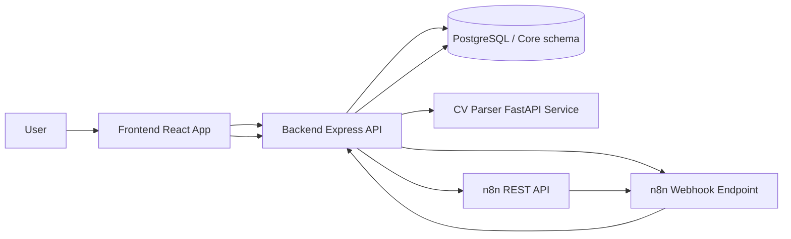
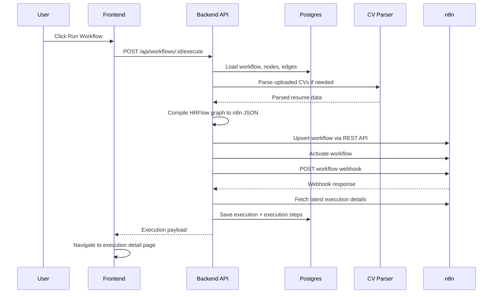
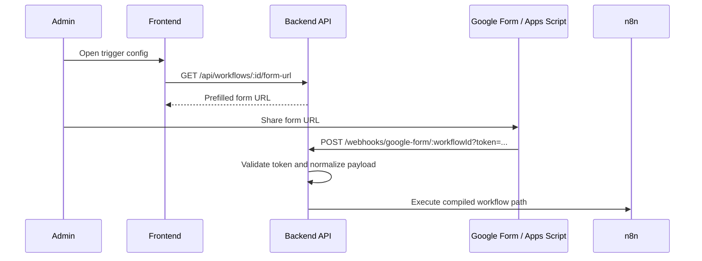

# HRFlow Project Writeup

Last updated: 2026-04-09

## 1. Executive Summary

HRFlow is a visual workflow automation platform for HR operations. The frontend lets users design workflows as graphs. The backend stores those graphs in PostgreSQL, compiles them into n8n workflows, triggers execution through n8n webhooks, and records execution results back into HRFlow for visibility and auditing.

The project is best understood as a control plane and observability layer around n8n:

- HRFlow owns workflow authoring, auth, admin, audit, and execution history.
- n8n owns actual runtime execution.
- A separate FastAPI service handles CV parsing before the n8n run begins.

The product already has a strong end-to-end story for a subset of node types, but it also has important mismatches between the builder, compiler, runtime security posture, and documentation. Those gaps are listed later in this document in a prioritized fix plan.

## 2. What The System Is

At a high level, the repository contains four application layers:

| Layer | Role | Main Tech |
| --- | --- | --- |
| Frontend | Workflow builder, dashboard, executions UI, admin UI | React, TypeScript, Vite, ReactFlow |
| Backend API | Auth, workflow CRUD, graph storage, execution orchestration, audit, dashboard APIs | Express 5, TypeScript, Prisma |
| Workflow engine | Runtime execution of compiled workflows | n8n |
| CV parser | Resume parsing and field extraction | FastAPI, Python |

The core user promise is:

1. Build a workflow visually.
2. Save the workflow graph into HRFlow's database.
3. Execute the workflow manually or via webhook.
4. Let HRFlow compile the graph into n8n.
5. Let n8n execute the compiled workflow.
6. Pull execution outputs back into HRFlow.
7. Review step-by-step results in HRFlow's UI.

## 3. What The System Is Not

This repository is not a general-purpose workflow engine implemented entirely in-house. It delegates execution to n8n.

It is also not a complete HRIS. The schema contains HR domain tables such as employees, jobs, candidates, applications, resumes, email templates, and webhooks, but the current product focus is workflow authoring, execution, monitoring, and admin tooling.

## 4. Architecture At A Glance

## 5. Repository Layout

| Path | Purpose |
| --- | --- |
| `README.md` | Top-level project overview and Docker-first setup |
| `SETUP.md` | Additional setup notes, with some outdated assumptions |
| `docker-compose.yml` | Local and deployment orchestration |
| `backend/` | Express API, Prisma schema, services, controllers, routes |
| `frontend/` | React SPA with builder, dashboard, executions, admin pages |
| `cv-parser/` | FastAPI resume parser |
| `docker/` | DB init SQL and tunnel startup script |
| `n8n-database.sql` | Preconfigured n8n DB backup |
| `n8n-backup.tar.gz` | Preconfigured n8n volume backup |

## 6. System Of Record By Concern

| Concern | System of record |
| --- | --- |
| Workflow definitions | HRFlow PostgreSQL |
| Workflow graph nodes and edges | HRFlow PostgreSQL |
| Runtime execution engine | n8n |
| Execution history shown in UI | HRFlow PostgreSQL |
| User auth and roles | HRFlow PostgreSQL |
| Audit logs | HRFlow PostgreSQL |
| Uploaded CV files | Backend local disk under `backend/uploads` |
| CV extraction output | HRFlow execution context and step output |

## 7. Tech Stack

### 7.1 Frontend

- React 19
- TypeScript
- Vite
- React Router
- ReactFlow
- dagre for layout
- sonner for notifications
- Bootstrap and custom styles
- Recharts for dashboard charts

### 7.2 Backend

- Express 5
- TypeScript
- Prisma
- PostgreSQL
- bcryptjs
- jsonwebtoken
- multer
- axios and fetch-based n8n integration
- winston logging

### 7.3 CV Parser

- FastAPI
- pypdf
- python-docx
- RapidFuzz
- regex-based extraction

### 7.4 Infrastructure

- Docker Compose
- Nginx for production frontend serving
- n8n
- PostgreSQL 15
- Serveo tunnel container

## 8. Core Product Concept

The most important mental model in this repo is:

- Users do not author n8n workflows directly.
- Users author HRFlow graphs.
- The backend compiles HRFlow graphs into n8n workflow JSON.
- n8n executes that compiled workflow.
- HRFlow then reconstructs step visibility from n8n results and stores it in its own tables.

That compiler boundary is the heart of the product.

## 9. High-Level User Journeys

### 9.1 Login And Session Validation

1. User submits email and password to `POST /api/auth/login`.
2. Backend validates credentials against `users` and `roles`, returns JWT plus user payload.
3. Frontend stores token and user in local storage.
4. On app boot, frontend calls `GET /api/auth/me` to validate the stored token.

Main files:

- `backend/src/controllers/authController.ts`
- `backend/src/services/authService.ts`
- `backend/src/middleware/authMiddleware.ts`
- `frontend/src/contexts/AuthContext.tsx`

### 9.2 Create Or Edit A Workflow

1. User opens the workflows area or dashboard.
2. Frontend creates a workflow via `POST /api/workflows`.
3. Frontend creates nodes and edges through workflow routes.
4. Backend stores graph state in `workflows`, `workflow_nodes`, and `workflow_edges`.
5. Builder re-fetches the graph after certain mutations.

Main files:

- `frontend/src/pages/Workflows/workflowBuilderPage.tsx`
- `frontend/src/api/workflows.ts`
- `backend/src/routes/workflowRoutes.ts`
- `backend/src/controllers/workflowController.ts`
- `backend/src/services/workflowService.ts`

### 9.3 Manual Workflow Execution

1. User clicks run in the builder or workflow list.
2. Frontend posts to `POST /api/workflows/:id/execute` with trigger input.
3. Backend loads the workflow graph from Postgres.
4. Backend pre-processes any CV parser nodes using uploaded files.
5. Backend compiles the HRFlow graph into n8n workflow JSON.
6. Backend upserts the n8n workflow by a stable name.
7. Backend activates the n8n workflow.
8. Backend triggers the n8n webhook.
9. Backend fetches the latest n8n execution details for that workflow.
10. Backend writes one `executions` row plus many `execution_steps` rows.
11. Frontend navigates to the execution detail page and renders the timeline.

Main files:

- `frontend/src/api/workflows.ts`
- `backend/src/controllers/executionController.ts`
- `backend/src/services/executionService.ts`
- `backend/src/services/n8nCompiler.ts`
- `backend/src/services/n8nService.ts`

### 9.4 Google Form Trigger Execution

1. User configures a trigger node to use Google Form mode.
2. Frontend requests a prefilled form URL from `GET /api/workflows/:id/form-url`.
3. Backend generates the prefilled form URL using environment variables.
4. A Google Form + Apps Script or equivalent integration posts form data to `POST /webhooks/google-form/:workflowId?token=...`.
5. Backend validates the token, normalizes field names, and triggers the workflow with `triggerType = google_form`.
6. Execution then follows the same orchestration path as a manual run.

Main files:

- `frontend/src/components/builder/ConfigPanel.tsx`
- `frontend/src/api/workflows.ts`
- `backend/src/controllers/workflowController.ts`
- `backend/src/utils/googleFormHelper.ts`
- `backend/src/routes/webhookRoutes.ts`
- `backend/src/controllers/googleFormController.ts`

### 9.5 CV Upload And Parse Flow

1. User uploads a file in the CV Parser node config.
2. Frontend posts multipart data to `POST /api/files/upload`.
3. Backend saves the file to local disk and records metadata in memory.
4. The node stores the uploaded `fileId` in its config.
5. On workflow execution, backend resolves the file by ID.
6. Backend calls the FastAPI CV parser at `/parse`.
7. Parsed fields are injected into the HRFlow execution context and per-step output.

Main files:

- `frontend/src/components/builder/ConfigPanel.tsx`
- `frontend/src/api/apiClient.ts`
- `backend/src/routes/fileRoutes.ts`
- `backend/src/services/fileUploadService.ts`
- `backend/src/services/cvParserService.ts`
- `cv-parser/main.py`

### 9.6 Dashboard And Notifications

1. Frontend dashboard loads stats and chart data from `/api/dashboard/stats` and `/api/dashboard/charts`.
2. Backend aggregates execution and workflow data through Prisma queries.
3. Execution notifications poll `/api/executions` every 15 seconds.
4. New executions are surfaced to the user through toast notifications.

Main files:

- `frontend/src/pages/Dashboard/DashboardPage.tsx`
- `frontend/src/api/dashboard.ts`
- `backend/src/routes/dashboardRoutes.ts`
- `backend/src/services/dashboardService.ts`
- `frontend/src/contexts/ExecutionNotificationContext.tsx`

## 10. End-To-End Flow Diagrams

### 10.1 Manual Execution Request Flow

### 10.2 Google Form Trigger Flow

## 11. Frontend Deep Dive

### 11.1 App Shell And Routing

The frontend starts in `frontend/src/main.tsx`, wraps the app in auth and execution notification context, and renders routes from `frontend/src/App.tsx`.

Routing model:

- `/login` is public.
- Most routes are wrapped by `ProtectedRoute` and `AppLayout`.
- Builder routes are protected but intentionally full-screen and bypass normal layout.

Main pages:

| Path | Page | Purpose |
| --- | --- | --- |
| `/login` | `LoginPage.tsx` | Authentication |
| `/` | `LandingPage.tsx` | Landing view after login |
| `/dashboard` | `DashboardPage.tsx` | Stats, charts, shortcuts |
| `/workflows` | `workflowListPage.tsx` | Browse, run, duplicate, delete workflows |
| `/workflows/:id/builder` | `workflowBuilderPage.tsx` | Main workflow editor |
| `/executions` | `executionListPage.tsx` | Execution list |
| `/executions/:id` | `executionDetailPage.tsx` | Execution timeline and payloads |
| `/admin/users` | `UserManagementPage.tsx` | User and role management |
| `/admin/security` | `SecurityPage.tsx` | Allow-list management |
| `/admin/audit-logs` | `AuditLogPage.tsx` | Audit history |

### 11.2 Builder Responsibilities

The builder is the most important frontend subsystem.

Responsibilities:

- Render workflow nodes and edges in ReactFlow.
- Auto-layout nodes with dagre.
- Create and delete nodes and edges.
- Open a per-node config panel.
- Persist node config and position back to backend.
- Execute the workflow.
- Surface Google Form trigger options.
- Apply templates.

Important builder pieces:

| File | Purpose |
| --- | --- |
| `workflowBuilderPage.tsx` | Main builder state, ReactFlow wiring, graph refresh, run action |
| `ConfigPanel.tsx` | Node-specific configuration UI |
| `NodePicker.tsx` | Add-node picker |
| `PremiumNode.tsx` | Main builder node rendering |
| `GhostNode.tsx` | Placeholder node for adding steps |
| `VariableGrid.tsx` and `VariablePicker.tsx` | Variable helper UI |

### 11.3 API Consumption Styles

The frontend currently uses two API styles:

- A general-purpose `apiClient.ts` wrapper that handles auth headers and 401 redirects.
- Direct `fetch` wrappers in domain files like `api/workflows.ts` and `api/executions.ts`.

This split is workable, but inconsistent. It also matters because some endpoints are currently public, so some direct fetches omit auth headers without breaking.

### 11.4 Execution UX

The execution detail page is one of the strongest product features.

It shows:

- Overall execution status
- Duration
- Per-step status
- Step input JSON
- Step output JSON
- Friendly log messages
- Specialized rendering for CV parser output and URL-blocking errors

The execution notification context adds lightweight polling-based observability on top.

## 12. Backend Deep Dive

### 12.1 App Bootstrap

The backend starts in `backend/src/server.ts`, loads environment variables from the repo root `.env`, validates config through `appConfig.ts`, and starts the Express app from `app.ts`.

App-level behavior:

- CORS enabled
- JSON body parsing enabled
- request ID middleware added
- `/health` route exposed
- `/webhooks/*` mounted without `/api`
- `/api/*` route tree mounted
- not-found and global error handlers applied

### 12.2 Route Groups

Current route groups:

| Route group | Purpose | Auth today |
| --- | --- | --- |
| `/api/auth` | Login, token verify, current user | Public for login and verify; auth for `/me` |
| `/api/workflows` | Workflow CRUD, graph CRUD, duplicate, execute, form URL | Authenticated |
| `/api/executions` | Execution list and detail | Public except delete |
| `/api/dashboard` | Dashboard stats and charts | Public |
| `/api/settings` | DB tables and allow-list | Authenticated, then admin for allow-list |
| `/api/users` | User management | Authenticated admin |
| `/api/roles` | Roles lookup | Public |
| `/api/audit` | Audit log access | Authenticated admin |
| `/api/files` | Upload, metadata, delete | Public |
| `/webhooks/google-form/:workflowId` | External trigger endpoint | Token-based query param auth |

### 12.3 Service Layer Responsibilities

The backend uses a fairly clean service split:

| Service | Responsibility |
| --- | --- |
| `workflowService.ts` | CRUD for workflows, nodes, edges, graph shaping |
| `executionService.ts` | Full execution lifecycle orchestration |
| `n8nCompiler.ts` | Transform HRFlow graph into n8n workflow JSON |
| `n8nService.ts` | REST API calls to n8n plus webhook execution helper |
| `authService.ts` | Password validation, JWT generation and verification |
| `auditService.ts` | Audit log writes and queries |
| `allowListService.ts` | HTTP URL extraction and allow-list enforcement |
| `dashboardService.ts` | Aggregated dashboard metrics |
| `fileUploadService.ts` | Local file storage and metadata tracking |
| `cvParserService.ts` | Calls external CV parser service |
| `userService.ts`, `roleService.ts` | Admin/user domain logic |

### 12.4 Execution Service: The Core Backend Workflow

`executionService.ts` is the most important backend file.

It does the following, in order:

1. Load workflow metadata.
2. Auto-activate inactive workflows.
3. Load nodes and edges.
4. Pre-run CV parser nodes using uploaded files.
5. Create an `executions` row with status `running`.
6. Audit-log execution start.
7. Compile the graph to n8n JSON.
8. Upsert the n8n workflow by stable name.
9. Save n8n workflow ID and webhook path back onto the workflow row.
10. Activate the n8n workflow.
11. Build a normalized trigger body with both nested and flat employee fields.
12. Call the n8n webhook.
13. Mark the execution `completed`, `failed`, or `engine_error`.
14. Fetch the most recent n8n execution for that workflow.
15. Synthesize `execution_steps` from node order plus n8n node outputs.
16. Override overall execution status to `failed` if any step failed.
17. Return execution, steps, and optional raw n8n result.

This file effectively defines the product's run-time behavior.

### 12.5 n8n Compiler

`n8nCompiler.ts` translates a list of HRFlow nodes and edges into n8n workflow JSON.

Compiler steps:

1. Extract URLs from workflow config.
2. Validate URLs against allow-list.
3. Determine reachable node order.
4. Create a leading n8n webhook node.
5. Map HRFlow nodes into n8n nodes.
6. Build n8n connection graph.

Supported runtime node mappings today:

| HRFlow kind | Compiler support | n8n output |
| --- | --- | --- |
| `trigger` | Yes | Set node |
| `http` | Yes | HTTP Request node |
| `logger` | Yes | Set node used for log metadata |
| `database` | Yes, but limited | Postgres node |
| `email` | Yes | Email Send node |
| `cv_parse` / `cv_parser` | Yes | Set node placeholder; actual parse happens before n8n |
| `variable` | Yes, but limited | Set node |
| `datetime` | Yes, but limited | Set node |
| `condition` | No real node compilation | Connections only, no actual IF node |
| `wait` | No | Falls through to no-op |

Unknown node kinds compile to `n8n-nodes-base.noOp`, which prevents total compiler failure but can hide product gaps.

### 12.6 n8n Service

`n8nService.ts` is the backend's integration boundary with n8n.

It provides:

- API key validation
- workflow lookup by name
- workflow create/update upsert logic
- activation and deactivation
- execution detail fetches
- webhook triggering

One important design detail: HRFlow identifies n8n workflows by a stable name like `HRFlow: Workflow Name (#123)`, not by storing compiled JSON itself long-term.

## 13. CV Parser Deep Dive

The CV parser is a separate FastAPI app.

It is not a machine-learning OCR pipeline. It is a structured text extraction service using:

- PDF and DOCX text extraction
- whitespace normalization
- regex-based email and phone parsing
- heuristic name extraction
- skill extraction using exact and fuzzy matching
- simple experience and education extraction

This is suitable for MVP parsing of text-based resumes, but not for image-heavy or scanned documents.

Important limitation: the code and service description sometimes imply OCR-like behavior, but the actual implementation is text extraction plus heuristics.

## 14. Database Model Overview

### 14.1 Core Workflow Tables

| Table | Purpose | Important fields |
| --- | --- | --- |
| `workflows` | Workflow metadata | `name`, `owner_user_id`, `is_active`, `n8n_workflow_id`, `n8n_webhook_path` |
| `workflow_nodes` | Stored graph nodes | `workflow_id`, `kind`, `name`, `config_json`, `pos_x`, `pos_y` |
| `workflow_edges` | Stored graph edges | `workflow_id`, `from_node_id`, `to_node_id`, `label`, `priority`, `condition_json` |
| `executions` | Workflow run history | `workflow_id`, `trigger_type`, `status`, `run_context`, `duration_ms`, `error_message`, `n8n_execution_id` |
| `execution_steps` | Per-node execution visibility | `execution_id`, `node_id`, `status`, `input_json`, `output_json`, `logs` |

### 14.2 Admin And Security Tables

| Table | Purpose |
| --- | --- |
| `users` | Users who can access HRFlow |
| `roles` | Role definitions |
| `audit_logs` | Audit trail for auth, workflow changes, execution activity, security actions |
| `allowed_domains` | HTTP request allow-list for workflow URLs |

### 14.3 Broader HR Domain Tables

| Table | Purpose |
| --- | --- |
| `employees` | Employee records |
| `jobs` | Job openings or job records |
| `candidates` | Candidate records |
| `applications` | Candidate-to-job applications |
| `resumes` | Candidate resume metadata and parsed JSON |
| `email_templates` | Stored email templates |
| `webhooks` | Workflow-associated webhook metadata |
| `data_stores` | Workflow-specific storage path metadata |

These domain tables suggest the long-term product direction extends beyond just workflow authoring.

## 15. Request Flow And Data Flow In Detail

### 15.1 Authoring Data Flow

Authoring follows this data path:

1. Builder mutates local ReactFlow state.
2. Frontend normalizes node and edge shape through `api/workflows.ts`.
3. Backend persists JSON config to `workflow_nodes.config_json` and edge conditions to `workflow_edges.condition_json`.
4. Frontend re-hydrates the graph from backend responses.

This means the backend database is the canonical source of truth for workflow state, not the frontend.

### 15.2 Manual Execution Data Flow

Manual execution data flow looks like this:

1. Input form collects employee-like fields.
2. Backend normalizes them into both:
   - `employee.name`, `employee.email`, etc.
   - flat fields like `name`, `email`, etc.
3. Compiler maps trigger expressions to explicit n8n node references.
4. n8n runs the compiled graph.
5. Backend stores raw engine info in `executions.run_context`.
6. Backend stores synthesized step-level input/output snapshots in `execution_steps`.
7. Frontend parses `run_context` and step JSON to render execution detail.

### 15.3 Google Form Data Flow

Google Form flow data path:

1. Google Form response payload arrives with arbitrary question labels.
2. Backend fuzzy-matches those labels into canonical keys such as `name`, `email`, `phone`, `department`, `role`, `resume_url`, `start_date`, and `manager_email`.
3. Non-standard fields are preserved.
4. Backend executes the workflow as if it were a manual trigger, using normalized form data as input.

### 15.4 CV Data Flow

CV flow data path:

1. Resume file is uploaded to backend disk.
2. Node config stores `fileId` and `fileName`.
3. Execution service resolves `fileId` to a disk file.
4. FastAPI parser returns extracted fields.
5. Execution service injects those fields into the step output and run context.
6. Frontend execution detail view renders them as part of the node's output.

### 15.5 Dashboard Data Flow

Dashboard flow is simpler:

1. Frontend requests aggregate stats and charts.
2. Backend queries workflows and executions.
3. Backend returns compact aggregate payloads.
4. Frontend renders stat cards and charts.

## 16. API Surface Summary

This is the practical API map a maintainer should know.

### 16.1 Auth

- `POST /api/auth/login`
- `POST /api/auth/verify`
- `GET /api/auth/me`

### 16.2 Workflows

- `GET /api/workflows`
- `POST /api/workflows`
- `GET /api/workflows/:id`
- `PATCH /api/workflows/:id`
- `DELETE /api/workflows/:id`
- `POST /api/workflows/:id/duplicate`
- `GET /api/workflows/:id/graph`
- `GET /api/workflows/:id/nodes`
- `POST /api/workflows/:id/nodes`
- `PUT /api/workflows/:id/nodes/:nodeId`
- `PATCH /api/workflows/:id/nodes/:nodeId/position`
- `DELETE /api/workflows/:id/nodes/:nodeId`
- `GET /api/workflows/:id/edges`
- `POST /api/workflows/:id/edges`
- `PUT /api/workflows/:id/edges/:edgeId`
- `DELETE /api/workflows/:id/edges/:edgeId`
- `GET /api/workflows/:id/executions`
- `GET /api/workflows/:id/form-url`
- `POST /api/workflows/:id/execute`

### 16.3 Executions

- `GET /api/executions`
- `GET /api/executions/:id`
- `GET /api/executions/:id/steps`
- `DELETE /api/executions/:id`

### 16.4 Dashboard

- `GET /api/dashboard/stats`
- `GET /api/dashboard/charts`

### 16.5 Admin And Settings

- `GET /api/settings/database-tables`
- `GET /api/settings/allow-list`
- `POST /api/settings/allow-list`
- `DELETE /api/settings/allow-list/:id`
- `GET /api/users`
- `GET /api/users/:id`
- `POST /api/users`
- `PUT /api/users/:id`
- `PATCH /api/users/:id/status`
- `PATCH /api/users/:id/password`
- `GET /api/roles`
- `GET /api/roles/:id`
- `GET /api/audit`
- `DELETE /api/audit/purge`
- `GET /api/audit/workflow/:workflowId`
- `GET /api/audit/execution/:executionId`
- `GET /api/audit/user/:userId`

### 16.6 File Upload And Webhooks

- `POST /api/files/upload`
- `GET /api/files/:id`
- `DELETE /api/files/:id`
- `POST /webhooks/google-form/:workflowId?token=...`

## 17. Security Model As Implemented Today

### 17.1 Intended Security Model

The codebase implies this intended model:

- JWT-protected application access
- Admin-only access to users, audit, and allow-list settings
- HTTP request allow-list for outbound workflow URLs
- Audit logging of important actions
- Token-validated external Google Form webhook

### 17.2 Actual Security Posture Today

The real implemented posture differs from intent in several places:

- `dashboard` routes are public.
- `executions` list and detail routes are public.
- `files` routes are public.
- allow-list defaults to open mode when empty.
- `.env.example` contains real-looking secrets.
- runtime files are committed under `backend/uploads`.

These are not just documentation gaps. Some are direct production risks.

## 18. Deployment And Environment Story

### 18.1 Docker Compose Topology

The Compose stack includes:

- `postgres`
- `n8n`
- `cv-parser`
- `backend`
- `frontend`
- `tunnel`

Notable behavior:

- Backend container runs `prisma generate`, `prisma db push`, `prisma db seed`, then `npm run dev`.
- Frontend is built and served through Nginx in full Docker mode.
- There is a tunnel container for exposing the backend publicly.

### 18.2 Startup Assumptions

The repository assumes maintainers restore a known-good n8n backup instead of provisioning credentials from scratch.

That is why the repo contains:

- `n8n-database.sql`
- `n8n-backup.tar.gz`

### 18.3 Environment Variables

Current required backend env vars from code:

- `DATABASE_URL`
- `JWT_SECRET`
- `N8N_API_KEY`

Important optional env vars:

- `PORT`
- `NODE_ENV`
- `JWT_EXPIRES_IN`
- `N8N_BASE_URL`
- `N8N_WEBHOOK_BASE_URL`
- `N8N_POSTGRES_CREDENTIAL_ID`
- `N8N_POSTGRES_CREDENTIAL_NAME`
- `N8N_SMTP_CREDENTIAL_ID`
- `N8N_SMTP_CREDENTIAL_NAME`
- `CV_PARSER_URL`
- `DEFAULT_EMAIL_SENDER`
- `DEFAULT_EMAIL_RECIPIENT`
- `GOOGLE_FORM_BASE_URL`
- `GOOGLE_FORM_WORKFLOW_ID_ENTRY`
- `WEBHOOK_SECRET_KEY`

Important documentation caveat:

- `server.ts` explicitly loads the root `.env`.
- `SETUP.md` says local backend uses `backend/.env`.
- Those statements conflict.

## 19. Seed Data And Bootstrapping

The Prisma seed script creates:

- `Admin` and `Operator` roles
- `admin@hrflow.local / admin123`
- `operator@hrflow.local / operator123`
- sample template workflows

It also migrates orphan workflows to the admin user.

Important note: the seed data itself demonstrates some product/implementation drift because it creates workflows using node kinds like `condition` that do not have full compiler support.

## 20. Current Product Reality: What Is Actually Supported

The builder presents a broad node palette. Runtime support is narrower.

| Node kind | Builder UI | Runtime support | Notes |
| --- | --- | --- | --- |
| `trigger` | Yes | Yes | Core entry node |
| `cv_parser` | Yes | Yes | Real parsing happens before n8n |
| `email` | Yes | Yes | Requires n8n SMTP credentials |
| `http` | Yes | Yes | URL allow-list enforced |
| `database` | Yes | Partial | UI suggests high-level DB actions; compiler mostly uses query/default insert |
| `variable` | Yes | Partial | Config shape mismatch in current implementation |
| `datetime` | Yes | Partial | Basic set-style date computation |
| `logger` | Yes | Yes | Implemented as metadata injection |
| `condition` | Yes | No real execution node | Edge-branch wiring exists, actual IF node compilation missing |
| `wait` | Yes | No | Falls back to no-op |

## 21. Important Mismatches And Design Drift

This section explains where the repo's UX and runtime behavior diverge.

### 21.1 Builder Node Types vs Compiler Support

The Node Picker and Config Panel advertise `condition` and `wait` as normal nodes, but `n8nCompiler.ts` does not compile them into working n8n nodes.

Impact:

- workflows can look valid in the UI but not behave as users expect
- templates can include non-functional behavior
- maintainers can be misled into thinking the feature exists end-to-end

### 21.2 HTTP Node Config Mismatch

The builder saves request payload under `body`, but the compiler reads `bodyTemplate`.

Impact:

- HTTP request bodies configured in the UI may not be sent at runtime

### 21.3 Variable Node Config Mismatch

The builder saves the user-entered variable value under `variableValue`, but the compiler reads `value`.

Impact:

- variable nodes may compile without the intended stored value

### 21.4 Database Node UX vs Runtime Capability

The UI presents operations like create, update, query, table selection, and filters. The compiler currently either:

- uses a raw `query` string if present, or
- falls back to a default candidate insert query

Impact:

- users may think they are configuring rich database actions when they are not

### 21.5 Allow-List Policy Mismatch

The Security page says empty allow-list means deny-all. The backend allows all traffic when the allow-list is empty.

Impact:

- the UI communicates a stricter security model than the backend enforces

### 21.6 Execution Correlation Gap

The backend fetches the latest n8n execution for a workflow instead of correlating the exact n8n execution that corresponds to the current HRFlow run.

Impact:

- concurrent runs of the same workflow can attach the wrong node outputs to the wrong HRFlow execution
- the unused `n8n_execution_id` column suggests this problem was anticipated but not finished

### 21.7 File Upload Storage Design Drift

File metadata is kept in memory with disk scanning as fallback for reads. Delete behavior does not use the same fallback pattern.

Impact:

- behavior across server restarts is inconsistent
- local disk becomes the de facto file store
- there is no durable file metadata table

### 21.8 Docs Drift

Current docs disagree on:

- which `.env` is loaded
- which frontend port is used in Docker mode
- what the local dev topology looks like

The frontend README is still generic Vite boilerplate and does not document the real app.

## 22. Priority Fixes

This section is the practical engineering plan for improving the repo.

### P0: Security And Data Exposure Fixes

#### P0.1 Secure Dashboard, Executions, And File Routes

Why it matters:

- execution history can expose workflow names, inputs, outputs, and errors
- dashboard APIs can expose organization-level stats
- file upload APIs can be abused for anonymous storage and access

Recommended fix:

- require `authenticate` on `/api/dashboard/*`
- require `authenticate` on `/api/executions/*`
- require `authenticate` on `/api/files/*`
- then update frontend calls to use authenticated request helpers consistently

#### P0.2 Remove Real-Looking Secrets From The Repository

Why it matters:

- `.env.example` should never contain reusable live-looking credentials or API keys
- committed backups may contain sensitive n8n data

Recommended fix:

- rotate any real credentials
- replace `.env.example` values with placeholders
- re-evaluate whether `n8n-database.sql` and `n8n-backup.tar.gz` belong in source control

#### P0.3 Remove Committed Runtime Uploads

Why it matters:

- `backend/uploads` contains real runtime PDFs committed to the repo
- this is a data governance and privacy problem

Recommended fix:

- remove committed upload artifacts
- add ignore rules for runtime uploads
- decide whether sample files should live in a dedicated sanitized fixture location instead

### P1: Correctness Fixes For The Core Product

#### P1.1 Correlate HRFlow Executions To Exact n8n Executions

Why it matters:

- current implementation uses the latest execution for the workflow, which is race-prone

Recommended fix:

- pass a unique correlation token in the webhook payload
- ensure n8n surfaces that token in execution output
- store the matching n8n execution ID back into `executions.n8n_execution_id`
- stop relying on `limit=1` by workflow alone

#### P1.2 Make Builder Node Support Match Runtime Support

Why it matters:

- users should not be able to configure nodes that do not execute as advertised

Recommended fix:

- either implement real compiler support for `condition` and `wait`
- or hide/mark them as unavailable until they are supported end-to-end

#### P1.3 Fix Config Shape Mismatches

Why it matters:

- builder-configured workflows do not always compile as intended

Recommended fix:

- unify `http` body key naming
- unify `variable` value key naming
- align database node config contract between UI and compiler

#### P1.4 Fix Allow-List Default Policy

Why it matters:

- security behavior should match admin expectations and UI messaging

Recommended fix:

- choose one policy and apply it consistently
- if empty allow-list should deny all, change backend implementation and update migration docs
- if open mode is intentional, rewrite the UI copy clearly

### P2: Reliability And Maintainability Fixes

#### P2.1 Move File Metadata Out Of Memory

Recommended fix:

- store uploaded file metadata in the database
- or use object storage with explicit expiration handling

#### P2.2 Normalize Frontend API Access

Recommended fix:

- standardize on one API client layer
- remove direct unauthenticated fetches for internal protected APIs

#### P2.3 Fix Dashboard Recent Activity Fetching

Current issue:

- the operator dashboard calls `/executions?limit=5` and expects an array, but the backend returns `{ data: executions }`
- the backend also ignores the `limit` query parameter entirely

Recommended fix:

- make the frontend consume the real response shape
- add backend support for `limit` and `offset`

#### P2.4 Add Real Test Coverage And Tooling

Recommended fix:

- add backend tests around execution orchestration, compiler output, auth, and security rules
- add frontend tests around builder behavior and execution rendering
- add at least a smoke/integration path for manual execution and Google Form flow

#### P2.5 Introduce Versioned Database Migrations

Current issue:

- the Docker flow uses `prisma db push`, not explicit migrations

Recommended fix:

- move to versioned Prisma migrations for safer schema evolution

### P3: Product Polish And Documentation Fixes

#### P3.1 Rewrite Public Docs

Recommended fix:

- update `README.md` and `SETUP.md`
- document the actual local and Docker startup modes
- explain the real env loading behavior

#### P3.2 Replace Frontend Boilerplate README

Recommended fix:

- replace generic Vite README with app-specific frontend documentation

#### P3.3 Tighten Seed And Template Quality

Recommended fix:

- ensure seeded workflows and templates only use truly supported node features
- fix dashboard template creation so node config is preserved when creating from template

## 23. Recommended Fix Order

If only one engineering team is available, the most sensible order is:

1. Secure public routes and remove secrets/data from repo.
2. Fix execution correlation with n8n.
3. Align builder-visible node types with actual compiler/runtime support.
4. Fix config key mismatches for HTTP, variable, and database nodes.
5. Clarify and implement the allow-list policy consistently.
6. Move file metadata to durable storage.
7. Add automated tests around the now-stabilized architecture.
8. Clean up docs and template quality.

## 24. Testing Status

Current testing maturity is low.

Observed state:

- backend `test` script is a placeholder that exits with an error
- frontend has no test tooling or test files
- only obvious test file in the repo is `cv-parser/test_parsing_logic.py`

Implication:

- core product behavior currently depends on manual validation
- the most fragile areas, namely compiler/runtime alignment and execution correlation, are not protected by tests

## 25. Operational Risks And Maintenance Notes

### 25.1 Runtime Coupling To n8n Availability

If n8n is unreachable or misconfigured, workflow execution fails even if HRFlow itself is healthy.

### 25.2 Runtime Coupling To Preconfigured Credentials

Database and email nodes depend on n8n credential IDs and names being present and aligned with the included backup.

### 25.3 Builder Save Model

The builder persists state directly to backend routes during editing. There is no separate draft/publish model.

### 25.4 Workflow Compilation Timing

Workflows are compiled and upserted into n8n during execution, not at save time.

Pros:

- no separate deployment step for workflows

Cons:

- every execution depends on compile + upsert + activate success
- runtime latency includes engine preparation work

## 26. Suggested Reading Order For New Maintainers

For a new engineer, the fastest accurate ramp-up path is:

1. `README.md`
2. `docker-compose.yml`
3. `backend/prisma/schema.prisma`
4. `backend/src/services/executionService.ts`
5. `backend/src/services/n8nCompiler.ts`
6. `backend/src/services/n8nService.ts`
7. `backend/src/services/workflowService.ts`
8. `frontend/src/App.tsx`
9. `frontend/src/pages/Workflows/workflowBuilderPage.tsx`
10. `frontend/src/components/builder/ConfigPanel.tsx`
11. `frontend/src/pages/Executions/executionDetailPage.tsx`
12. `cv-parser/main.py`

## 27. Key Takeaways

HRFlow already has a meaningful core architecture:

- the frontend provides a capable workflow authoring experience
- the backend has a good service split
- the execution pipeline from HRFlow to n8n and back is conceptually strong
- the execution detail UI is a real product asset

The repo's current weaknesses are not about lack of direction. They are about alignment:

- alignment between UI promises and compiler support
- alignment between intended security and actual route protection
- alignment between runtime data correlation and true execution identity
- alignment between docs and real deployment behavior

Once those alignment issues are fixed, the project will be much easier to trust, maintain, and extend.

## 28. Short Conclusion

This project is a visual HR workflow platform built on top of n8n, with HRFlow acting as the authoring, orchestration, and observability layer. The architecture is understandable and viable. The biggest next step is not adding more features first. It is tightening correctness, security, and documentation around the features that already exist.
